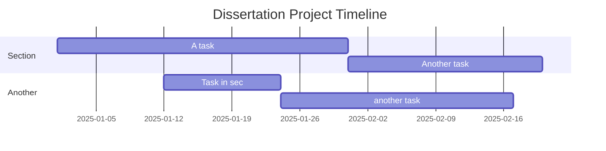

# PhD Project Name Pending

## Info

This is a project looking at the pronatalist community on reddit. 

### Software Requirements
Currently this all works on either linux or mac osx (more work is needed here).

Testing some of the workloads on H100, B200, B300, M1 and M4 SoCs. 

git lfs support is utilized since the data sets can exceed 50Mb.

## Time line

-RC 

